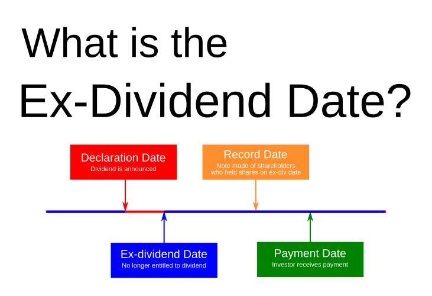
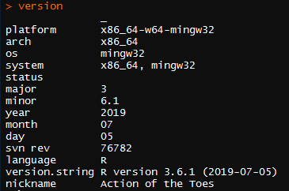
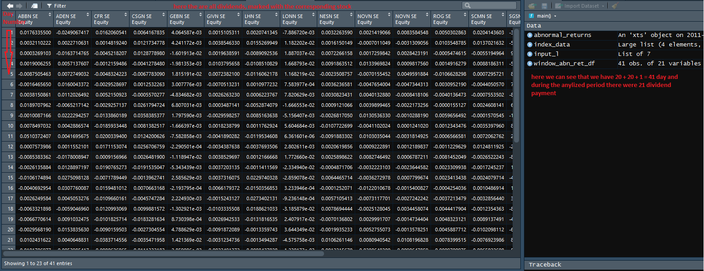

```{r setup, include=FALSE}
knitr::opts_chunk$set(echo = TRUE, fig.pos= "h")
```

```{r echo=FALSE, message=FALSE, warning=FALSE}

#
# This is a Shiny web application. You can run the application by clicking
# the 'Run App' button above.
#
# Find out more about building applications with Shiny here:
#
#    http://shiny.rstudio.com/
#
.libPaths("C:/Users/paa/AppData/Local/Temp/RLibs")
library(shiny)
library(lubridate)
library(Rblpapi)
library(xts)
library(PerformanceAnalytics)
library(reshape)
library(DT)
library(tseries)


pick_div_type_shiny <- function(stock_names,
                                bbcon,
                                start_date,
                                end_date,
                                div_types){
  
  # To create selection list, the whole download process should 
  # be done, so here also the final dividend dataframe is created
  
  # Get Ex Dividend date for all required stocks
  
  div_data_l <- lapply(stock_names, get_exDiv_dates)
  
  # All data frames in a list have the same structure. Merge them all like rbind()
  if(length(div_data_l) > 1){
    # The function works only with several objects
    div_data_df <- merge_recurse(div_data_l)  
  }
  else{
    div_data_df <- as.data.frame(div_data_l)
  }
  
  
  # After the merge some columns with all NA can appear. Columns with NA should be deleted
  div_data_df <- div_data_df[, colSums(is.na(div_data_df)) == 0]
  
  colnames(div_data_df) <- c("Date", "Type", "Stock Name")
  
  # Take into accound time window
  div_data_df <- div_data_df[div_data_df$`Date` >= start_date &
                               div_data_df$`Date` <= end_date, ]
  # Dividend type filter
  div_data_df <- div_data_df[div_data_df$`Type` %in% div_types, ]
  
  if(nrow(div_data_df) > 0){
    # reset index
    rownames(div_data_df) <- NULL
    
    available_div_types <- unique(div_data_df$`Type`)
    
    num_of_div_types <- length(available_div_types)
    
    if (num_of_div_types == 0) {
      stop(
        "There were no dividends of selected type during selected period. Further research does not have any sense with these input parameters"
      )
      
      return(NULL)
    }
    else{
      # there were dividends. The research makes sense
      
      
      return_list <- list(div_types = available_div_types,
                          div_data_df = div_data_df)
      
      return(return_list)
    }
  }
  else{
    stop("There were no dividends of selected type during selected period. Further research does not have any sense with these input parameters")
  }
  
}

set_date_index <- function(df){
  # Assumptions: 1) df contains "date" column,
  #              2) df contains "px_last" column
  # if not, the funciton is not supposed to work
  
  tryCatch(
    {
      # try part
      rownames(df) <- df$date
      
      # final data frame should contain only 1 column but still be a df.
      df <- df[,"px_last", drop = FALSE]
      
      # Create time-series object
      df <- xts(x = df, order.by = as.Date(rownames(df)))
      
      return(df)
    },
    error = function(cond){
      # show original error message
      message("in lapply df structure is wrong")
      message(cond)
    }
  )
}

define_reporting_type <- function(year_period_v){
  
  if(class(year_period_v) == "character"){
    year_period_v <- ifelse(test = grepl(x = year_period_v, pattern = "A"), yes = "A" , no = year_period_v)
    year_period_v <- ifelse(test = grepl(x = year_period_v, pattern = "Q"), yes = "Q" , no = year_period_v)
    year_period_v <- ifelse(test = grepl(x = year_period_v, pattern = "S"), yes = "S" , no = year_period_v)
    
    return(year_period_v)
  }
  else{
    stop("Reporting type mapping failed, since provided parameter is of wrong type")
    return(NA)
  }
}

get_reporting_dates <- function(stock_name){
  
  if(length(stock_name == 1)){
    
    stock_reporting_dates_info <- bds(security = stock_name,
                                      field = "EARN_ANN_DT_TIME_HIST_WITH_EPS")
    
    if(is.null(stock_reporting_dates_info) == FALSE){
      
      if(sum(colnames(stock_reporting_dates_info) %in% c("Announcement Date", "Year/Period")) == 2 ){
        # Get data frame with 2 columns Ex-Date and Dividend Type column
        stock_reporting_date_df <- stock_reporting_dates_info[ , c("Announcement Date", "Year/Period"), drop = FALSE]
        
        # Finaly, 3 date, type and stock name is required
        stock_reporting_date_df$stock_name <- stock_name
        
        # Only type of reporting date should be stored
        stock_reporting_date_df$`Year/Period` <- define_reporting_type(stock_reporting_date_df$`Year/Period`)
        
        # Dates with missing data should not be used
        stock_reporting_date_df <- na.omit(stock_reporting_date_df)
        
        colnames(stock_reporting_date_df) <- c("Announcement Date", "Reporting Type", "Stock Name")
        
        # time-series is impossible to use because of date duplicates
        return(stock_reporting_date_df)  
      }
      else{
        stop("Column names used in get_reporting_dates are not correct")
        return(NA)
      }
    }
    else{
      # data frame is empty
      message(stock_name, " has not had any reporting yet")
      return(NA)
    }
  }
  else{
    stop("Error in stock reporting dates acquisition. Stock name parameter must contain only 1 value.")
    return(NA)  
  }
}

pick_reporting_dates <- function(stock_names,
                                bbcon,
                                start_date,
                                end_date,
                                reporting_types){
  
  if(length(stock_names) >= 1){
    
    # Get reporting dates info for all stocks
    reporting_data_l <- lapply(stock_names, get_reporting_dates)
    
    # All data frames in a list have the same structure. Merge them all like rbind()
    if(length(reporting_data_l) > 1){
      # The function works only with several objects
      reporting_data_df <- merge_recurse(reporting_data_l)  
    }
    else{
      reporting_data_df <- as.data.frame(reporting_data_l)
    }
    
    
    # After the merge some columns with all NA can appear. Columns with NA should be deleted
    reporting_data_df <- reporting_data_df[, colSums(is.na(reporting_data_df)) == 0]
    
    colnames(reporting_data_df) <- c("Date", "Type", "Stock Name")
    
    # Take into accound time window
    reporting_data_df <- reporting_data_df[reporting_data_df$`Date` >= start_date &
                                             reporting_data_df$`Date` <= end_date, ]
    # Dividend type filter
    reporting_data_df <- reporting_data_df[reporting_data_df$`Type` %in% reporting_types, ]
    
    if(nrow(reporting_data_df) > 0){
      # reset index
      rownames(reporting_data_df) <- NULL
      
      available_reporting_types <- unique(reporting_data_df$`Type`)
      
      num_of_reporting_types <- length(available_reporting_types)
    
      return_list <- list(reporting_types = available_reporting_types,
                          reporting_data_df = reporting_data_df)
      
      return(return_list)
    }
    else{
      stop("There were no reporting dates  of selected type during selected period. Further research does not have any sense with these input parameters")
    }
  }
  else{
    stop("no stocks provided")
  }
}

get_exDiv_dates <- function(stock_name){
  
  # bds funtion with param. DVD_HIST_ALL gets from Bloomberg
  # all dividend-relevant information. Output is a data frame
  # Assumptions: stock_name contains only 1 value
  if(length(stock_name) != 1){
    stop("Error in stock dividend dates acquisition. Stock name parameter must contain only 1 value.")
  }
  
  stock_div_info <- bds(security = stock_name,
                        field = "DVD_HIST_ALL")
  if(is.null(stock_div_info) == FALSE){
    
    # Get data frame with 2 columns Ex-Date and Dividend Type column
    stock_ExDiv_date_df <- stock_div_info[ , c("Ex-Date", "Dividend Type"), drop = FALSE]
    
    # Finaly, 3 date, type and stock name is required
    stock_ExDiv_date_df$stock_name <- stock_name
    
    colnames(stock_ExDiv_date_df) <- c("Ex-Date", "Dividend Type", "Stock Name")
    
    # time-series is impossible to use because of date duplicates
    return(stock_ExDiv_date_df)  
  }
  else{
    # data frame is empty
    message(stock_name, " has not had any dividends yet")
    return(NA)
  }
}

download_data_shiny <- function(index_name,
                                start_date,
                                end_date,
                                stocks,
                                div_types,
                                periodicity = "DAILY",
                                reporting_types) {
  
  # Dividend Type Input
  if(is.null(div_types) == TRUE){
    stop("No dividend types are selected")
  }
  else if(div_types == 'ALL'){
    div_types <- c("Regular Cash", "Return of Capital", "Spinoff")
  }
  else{} # Nothing already correct
  
  # Reporting Type Input
  if(is.null(reporting_types) == TRUE){
    message("No reporting types are selected; annual, semi-annual and quarter are used")
    reporting_types <-  c("A", "S", "Q")
  }else if (reporting_types == 'ALL'){
      reporting_types <- c("A", "S", "Q")
  }else{} # Nothing already correct
  
  
  # Stock Names Input
  if(is.null(stocks) == TRUE){
    stop("No stocks are selected")
  }
  else if(stocks == 'ALL'){
    
    stocks <- c("ABBN SE Equity", "ADEN SE Equity",
                "ALC SE Equity",  "CFR SE Equity",  "CSGN SE Equity",
                "GEBN SE Equity", "GIVN SE Equity", "LHN SE Equity",
                "LONN SE Equity", "NESN SE Equity", "NOVN SE Equity",
                "ROG SE Equity",  "SCMN SE Equity", "SGSN SE Equity",
                "SIKA SE Equity", "SLHN SE Equity", "SREN SE Equity", 
                "UBSG SE Equity", "UHR SE Equity",  "ZURN SE Equity")
  }
  else{} # Nothing already correct
  

  
  
  
  opt <- c("periodicitySelection" = periodicity)
  
  # Connect to the Bloomberg API
  bbcon <- blpConnect()
  
  # Using Bloomberg API retrieve 'bdh' (Bloomberg Data History) queries
  index_price <- bdh(securities = index_name,
                     fields = "px_last",
                     start.date = start_date,
                     end.date = end_date,
                     con = bbcon,
                     options = opt
  )
  
  # Convert to time-series object
  index_price_xts <- set_date_index(df = index_price)
  colnames(index_price_xts) <- index_name
  
  # Get prices for all the index constituents from Bloomberg
  # Here stock_returns is a list of data frames
  stocks_prices_l <- bdh(securities = stocks,
                         fields = "px_last",
                         start.date = start_date,
                         end.date = end_date,
                         options = opt)
  
  # To work efficiently one common time-series object (xts) should be created
  # Step 1: for each df set date index and create a time-series object
  if(class(stocks_prices_l) == "data.frame"){
    # In this case stocks_prices_l is a single data frame (like with index)
    stocks_prices_xts <- set_date_index(df = stocks_prices_l)
    colnames(stocks_prices_xts) <- stocks
    
  }else{
    stocks_prices_l <- lapply(X = stocks_prices_l, FUN = set_date_index)
    # API reschuffles names of stocks
    reordered_names <- names(stocks_prices_l)
    
    # Step 2: Unite time-series creating one xts object and set stocks' names
    stocks_prices_xts <- do.call(what = merge, args = stocks_prices_l)
    colnames(stocks_prices_xts) <- reordered_names
  }
  
  
  
  # Calculate index total simple returns
  index_total_returns_xts <- Return.calculate(prices = index_price_xts,
                                              method = "discrete")
  
  # Calculate index constituencies' total simple returns: (p_new - p_old)/p_old
  stocks_total_returns_xts <- Return.calculate(prices = stocks_prices_xts,
                                               method = "discrete")
  
  div_data_l <- pick_div_type_shiny(stock_names = stocks,
                                    bbcon = bbcon,
                                    start_date = start_date,
                                    end_date = end_date,
                                    div_types = div_types)
  
  reporting_data_l <- pick_reporting_dates(stock_names = stocks,
                                           bbcon = bbcon,
                                           start_date = start_date,
                                           end_date = end_date,
                                           reporting_types = reporting_types)
  
  return_list <- list(index_price = index_price,
                      index_return = index_total_returns_xts,
                      stocks_prices = stocks_prices_xts,
                      stocks_returns = stocks_total_returns_xts,
                      div_data_df = div_data_l$div_data_df,
                      reporting_data_df = reporting_data_l$reporting_data_df
  )
  
  return(return_list)
}  

# Calculate abnormal returns for a single stock
calc_abnorm_ret <- function(stock_returns, index_returns){
  # use formula ABN_returns_t = ln(1+rs_t) - ln(1+rm_t)
  stock_returns <- log(stock_returns + 1)
  index_returns <- log(index_returns + 1)
  abn_return <- stock_returns - index_returns
  
  # abn_return is time-series xts object
  return(abn_return)
}

# Calculate abnormal returns for all stocks for all dates
calc_abnorm_ret_all <- function(stocks_returns_xts, index_returns_xts){
  
  # Here lapply() can be used but it is much more complicated 
  # View(as.data.frame(lapply( as.list(stocks_returns_xts), calc_abnorm_ret, index_returns = index_data$index_return$`SMI Index`)))
  if(!any(class(stocks_returns_xts) == "xts")){
    stop("Abrormal returns are not in xts format")
  }
  
  stock_names <- colnames(stocks_returns_xts)
  n <- ncol(stocks_returns_xts)
  abn_ret_all <- NULL
  
  for(i in 1:n){
    abn_ret_1 <- calc_abnorm_ret(stocks_returns_xts[,i], index_returns_xts)
    abn_ret_all <- cbind(abn_ret_all, abn_ret_1) 
  }
  
  colnames(abn_ret_all) <- stock_names
  
  # drop 1 row with NA
  abn_ret_all <- abn_ret_all[-1,]
  
  return(abn_ret_all)
}

# The function calculates a stock abnormal returns around ExDiv date
get_stock_abn_ret_window <- function(single_date, abnorm_ret_stock_xts, period){
  
  # single_date is supposed to be a data frame (checked earlier)
  # abnormal_ret_all_xts is time-series object (checked earlier)
  
  # get row with ExDiv date
  t0_ind <- which(index(abnorm_ret_stock_xts) == single_date)
  
  start_date_ind <- t0_ind - period
  end_date_ind <- t0_ind + period
  
  if(start_date_ind < 1 | end_date_ind > length(abnorm_ret_stock_xts)){
    stop("The period is too big for chosen start and end dates")
    return(NULL)
  }
  else{
    start_date <- index(abnorm_ret_stock_xts[start_date_ind,])
    end_date <- index(abnorm_ret_stock_xts[end_date_ind,])
    
    # Subset required period
    analyzed_window <-
      window(abnorm_ret_stock_xts, start = start_date, end = end_date)
    
    # Create an output data frame object. we need to later bind dfs
    # with different dates
    stock_window_abn_ret_df <- data.frame(analyzed_window)
    
    return(stock_window_abn_ret_df)
  }
  
  
}

# The function calculates abn. ret. around all ExDiv dates
# and unites results in a common data frame
get_stocks_abn_ret_window <- function(abnorm_ret_all_xts, Event_dates, period){
  
  # abnorm_ret_all_xts is supposed to be xts (time-series)
  # if there is no any class = "xts" the object is of wrong type (xts object is "xts" and "zoo" )
  if(!any(class(abnorm_ret_all_xts) == "xts")){
    stop("Abrormal returns are not in xts format")
  }
  
  # we need a vector to apply "sapply"
  if(class(Event_dates) != "data.frame"){
    stop("Divident dates is not in data.frame format")
  }
  
  # list with abn. ret. around Ex.date for all ExDates
  l <- list()
  j = 1
  
  original_stocks_names <- Event_dates$`Stock Name`
  not_valid_stocks <- c()
  
  # List with abn. ret. for each div.date
  for(i in 1:nrow(Event_dates)){
    
    # pick ExDiv date
    single_date <- Event_dates$Date[i]
    
    # pick the corresponding stock
    stock_name <- Event_dates$`Stock Name`[i]
    
    # get abnormal returns for picked stock
    abnorm_ret_stock_xts <- abnorm_ret_all_xts[ ,stock_name, drop = FALSE]
    
    # stocks with NA returns should not be used
    if(sum(is.na(abnorm_ret_stock_xts)) == 0){
      
      l[j] <- get_stock_abn_ret_window(single_date = single_date,
                                       abnorm_ret_stock_xts = abnorm_ret_stock_xts,
                                       period = period)
      j <- j + 1
    }
    else{
      message("\n", stock_name, " returns contain NA, the stock is not used")
      not_valid_stocks <- c(not_valid_stocks, i)
    }
  }
  
  # Unite in one data frame all single stock's abn. ret.
  df <- data.frame(l)
  
  if(length(not_valid_stocks) > 0){
    valid_stock_names <- original_stocks_names[-not_valid_stocks]  
  }
  else{
    valid_stock_names <- original_stocks_names
  }
  
  colnames(df) <- valid_stock_names
  
  return(df)
}

# Execute t.test with mean = 0 for all rows in data frame
execute_ttest0 <- function(analized_df){
  
  # we need a vector to apply "sapply"
  if(class(analized_df) != "data.frame"){
    stop("Execute t.test: provided parameter is not in data.frame format")
  }
  
  # Execute t-test
  # to store p.values for all tests
  pvalue_all <- c()
  tvalue_all <- c()
  n <- nrow(analized_df)
  
  message("\n t.test is done using ", ncol(analized_df), " observations \n")
  
  # Execute t.test with mean = 0 for all rows in data frame
  for(i in 1:n){
    
    tryCatch(
      {
        pvalue_jbt <- jarque.bera.test(x = unlist(analized_df[i, ]))[3]
        if(pvalue_jbt < 0.05){
          message("the normality assumption in t-test is violated")
        }
        ttest_res <- t.test(unlist(analized_df[i, ]), mu = 0)
      },
      error = function(cond)
      {
        # show original error message
        stop("not enough observations for normality test and t.test")
      }
    )
    
    # [3] - stands for p.value of the test
    pvalue <- ttest_res[3]
    tvalue <- ttest_res[1]
    
    # Original output is a list
    pvalue <- unlist(pvalue)
    pvalue_all <- c(pvalue_all, pvalue)
    
    # Original output is a list
    tvalue <- unlist(tvalue)
    tvalue_all <- c(tvalue_all, tvalue)
  }
  
  if(class(pvalue_all) != "numeric" | class(tvalue_all) != "numeric"){
    stop("p.values or t.values are not of numeric type")
  }
  else{
    
    # we need here simple named vector [Note: n of tests is one less]
    names(pvalue_all) <- as.character(seq(1:n))
    names(tvalue_all) <- as.character(seq(1:n))
    
    # check if there is at least one significant
    significant_index <- which(pvalue_all < 0.05)
  }
  
  result_list <- list(pvalues = pvalue_all,
                      tvalues = tvalue_all)
  return(result_list)
}

# The funciton concludes if portfolio returns are abnormal (or no significant difference)
calc_avg_day_abn_ret <- function(stocks_abn_ret_window){
  # the input data frame contains ABN_returns_t = ln(1+rs_t) - ln(1+rm_t)
  
  average_returns_daily <- rowMeans(stocks_abn_ret_window, na.rm = TRUE)
  
  # returns pvalues and tvalues
  pt_values <- execute_ttest0(stocks_abn_ret_window)
  
  result_list <- list(average_returns_daily = average_returns_daily,
                      pvalues = pt_values$pvalues,
                      tvalues = pt_values$tvalues)
  
  return(result_list)
}  

# Calculate cumulative returns stock by stock 
calc_cumsum_df <- function(stocks_abn_ret_window){
  
  # The input parameter is a data frame with columns 
  # that contains abnormal returns for each stock
  # number of rows is number of days in the period window
  
  # The function cumsum() is applied to each column of a data frame
  cumsum_l <- lapply(stocks_abn_ret_window, cumsum)
  
  # make sure names are correct
  col_names <- names(cumsum_l)
  
  # Tre output is a list, a data frame is required
  cum_sum_df <- data.frame(cumsum_l)
  colnames(cum_sum_df) <- col_names
  
  return(cum_sum_df)
}

calc_avg_day_cumsum <- function(stocks_abn_ret_window){
  # The function executes t.test for each day
  # to check if cumsum until this day significantly differs from 0
  
  cumsum_abn_ret <- calc_cumsum_df(stocks_abn_ret_window)
  
  avg_daily_cumsum <- rowMeans(cumsum_abn_ret, na.rm = TRUE)
  
  pt_values <- execute_ttest0(cumsum_abn_ret)
  
  # This returns pvalues from t.test
  result_list <- list(avg_cum_day_ret = avg_daily_cumsum,
                      pvalues = pt_values$pvalues,
                      tvalues = pt_values$tvalues)
  return(result_list)
  
}

# The function should analize smaller subwindows of abnormal returns to 
# find out where the outperformance comes from
rolling_window_analysis <- function(window_abn_ret_df, rollwind_size){
  
  # number of different windows
  times <- nrow(window_abn_ret_df) - rollwind_size + 1
  
  stocks_num <- ncol(window_abn_ret_df)
  
  cumsum_wind_ma <- matrix(data = rep(0, times = times * stocks_num),
                           nrow = times,
                           ncol = stocks_num)
  
  colnames(cumsum_wind_ma) <- colnames(window_abn_ret_df)
  
  # For each window
  for(i in 1:times){
    
    # Get the window
    required_rows_ind <- seq(from = i, to = (i + rollwind_size - 1))
    # window_df contains abn.ret (not cummulated)
    window_df <- window_abn_ret_df[required_rows_ind, ]
    
    # Calculate cumulative return for the window period
    stock_wind_cumsum <- colSums(window_df, na.rm = TRUE)
    
    # Save period return for a rolling window
    cumsum_wind_ma[i,] <- stock_wind_cumsum
  }
  
  # The data frame contains cumsum (period return) for each of the rolling windows
  winds_cumsum_df <- data.frame(cumsum_wind_ma)
  
  # Average window return
  avg_window_cumsum <- rowMeans(winds_cumsum_df)
  
  # H0: mean rolling window return is 0
  ptvalues <- execute_ttest0(analized_df = winds_cumsum_df)
  
  return_list <- list(avg_window_cumsum = avg_window_cumsum,
                      pvalues = ptvalues$pvalues,
                      tvalues = ptvalues$tvalues)
  
  return(return_list)
}

# Description is inside
analyze_period <- function(window_abn_ret_df, rollwind_size){
  
  # Currently there are 3 types of analysis:
  # 1) For the whole period (Ex. [Ex-date - 20, Ex-date + 20]) average daily abn. returns (values and t.test against 0)
  # 2) For the whole period cumulative abn. returns (values and t.test against 0)
  # 3) Rolling window analysis: check if cumsum during the small rolling window is signif. diff. from 0 (t.test is used)
  
  avg_day_abn_ret_result_l <- calc_avg_day_abn_ret(window_abn_ret_df)
  avg_day_cumsum_result_l <- calc_avg_day_cumsum(window_abn_ret_df)
  roll_wind_analysis_result_l <- rolling_window_analysis(window_abn_ret_df, rollwind_size)
  
  return_list <- list(abn_ret_l = avg_day_abn_ret_result_l,
                      cumsum_l = avg_day_cumsum_result_l,
                      roll_wind_l = roll_wind_analysis_result_l)
}

plot_with_signif_indication <- function(values, pvalues, title, sign_lvl, rw_flag){
  
  # ifelse is applied sequentially
  # t.test H0 is that mean is equal to 0 (in our case)
  color <- ifelse(test = pvalues < sign_lvl, yes = "red", no = "black")
  points_type <- ifelse(test = pvalues < sign_lvl, yes = 20, no = 1)
  
  if(rw_flag == FALSE){
    # Plot for a period
    
    n <- length(values)
    x_ind <- seq(1:n)
    # subtract ineger half of period (for each element of the sequence)
    x_ind <- x_ind - floor(n / 2)
    return(plot(x = x_ind, y = values, main = title, xlab = "Day Number", col = color, pch = points_type))
  }
  else{
    # Plot for a rolling-window analysis
    return(plot(values, main = title, xlab = "Rolling-window Number", col = color, pch = points_type))
  }
  
  
}

visualize_analysis_results <- function(analysis_results_l, sign_lvl){
  
  
  abn_ret <- plot_with_signif_indication(values = analysis_results_l$abn_ret_l$average_returns_daily,
                                         pvalues = analysis_results_l$abn_ret_l$pvalues,
                                         title = "Average daily abnormal returns",
                                         sign_lvl = sign_lvl,
                                         rw_flag = FALSE)
  
  cumsum <- plot_with_signif_indication(values = analysis_results_l$cumsum_l$avg_cum_day_ret,
                                        pvalues = analysis_results_l$cumsum_l$pvalues,
                                        title = "Average cumulative sums by day (including the last day)",
                                        sign_lvl = sign_lvl,
                                        rw_flag = FALSE)
  
  roll_wind <- plot_with_signif_indication(values = analysis_results_l$roll_wind_l$avg_window_cumsum,
                                           pvalues = analysis_results_l$roll_wind_l$pvalues,
                                           title = "Average rolling window cumulative sums",
                                           sign_lvl = sign_lvl,
                                           rw_flag = TRUE)
  
  return_list <- list(plot_abn_ret = abn_ret,
                      plot_cumsum = cumsum,
                      plot_roll_wind = roll_wind)
  return(return_list)
  
}

input_valudation_check <- function(index_name,
                                   start_date,
                                   end_date,
                                   stocks,
                                   div_types,
                                   reporting_types){
  # Check if input is empty
  req(index_name)
  req(start_date)
  req(end_date)
  req(stocks)
  req(div_types)
  req(reporting_types)
  
  return(NULL)
}

# Define UI for application that draws a histogram
ui <- fluidPage(
  
  # Application title
  titlePanel(title = "Event Study Report", windowTitle = "Event Study Report"),
  
  sidebarLayout(
    sidebarPanel(
      
      selectInput("index_name", label = "Index Name:",
                  choices = c("SMI Index"), selected = "SMI Index"),
      
      selectInput("stocks", label = "Stocks to use:", multiple = TRUE,
                  choices = c("ALL", "ABBN SE Equity", "ADEN SE Equity",
                              "ALC SE Equity",  "CFR SE Equity",  "CSGN SE Equity",
                              "GEBN SE Equity", "GIVN SE Equity", "LHN SE Equity",
                              "LONN SE Equity", "NESN SE Equity", "NOVN SE Equity",
                              "ROG SE Equity",  "SCMN SE Equity", "SGSN SE Equity",
                              "SIKA SE Equity", "SLHN SE Equity", "SREN SE Equity", 
                              "UBSG SE Equity", "UHR SE Equity",  "ZURN SE Equity"), selected = "ALL"),
      
      dateInput(inputId = "start_date", label = "Start Date:", value = "2018-01-01"),
      dateInput(inputId = "end_date", label = "End Date:"),
      
      selectInput("div_types", label = "Dividend types to use:", multiple = TRUE,
                  choices = c("ALL", "Regular Cash", "Return of Capital", "Spinoff"), selected = "ALL"),
      
      selectInput("reporting_types", label = "Reporting types to use:", multiple = TRUE,
                  choices = c("ALL", "A", "S", "Q"), selected = "ALL"),
      
      radioButtons("event_type", h3("Event Type"),
                   choices = list("Dividend" = "Dividend", "Report" = "Report"), selected = "Report"),
      
      selectInput("sign_lvl", label = "Significant level to use:",
                  choices = c(0.05, 0.1)),
      
      sliderInput("period_size", label = "Period Size:",
                  min = 1, max = 50, value = 20, step = 1),
      
      sliderInput("roll_window_size", label = "Rolling-window Size:",
                  min = 1, max = 50, value = 10, step = 1)
      
    ),
    mainPanel(
      # dataTableOutput(outputId = "view"),
      plotOutput(outputId = "plot_abn_ret"),
      plotOutput(outputId = "plot_cumsum"),
      plotOutput(outputId = "plot_roll_wind")
    )
  )
)

# Define server logic required to draw a histogram
server <- function(input, output) {
  
  # Currently only empty input is prevented
  # reactive(input_valudation_check(index_name = input$index_name,
  #                       start_date = as.Date(input$start_date),
  #                       end_date = as.Date(input$end_date),
  #                       stocks = input$stocks,
  #                       div_types = input$div_types,
  #                       reporting_types = input$reporting_types))
  
  
  # The data depends on input parameters
  index_data <- reactive(download_data_shiny(index_name = input$index_name,
                                             start_date = as.Date(input$start_date),
                                             end_date = as.Date(input$end_date),
                                             stocks = input$stocks,
                                             div_types = input$div_types,
                                             reporting_types = input$reporting_types))
  
  abnormal_returns <- reactive(calc_abnorm_ret_all(stocks_returns_xts = index_data()$stocks_returns,
                                                   index_returns_xts = index_data()$index_return))
  
  state <- reactiveValues()
  
  observe({
    if(input$event_type == 'Dividend'){
      
      state$event_dates <- index_data()$div_data_df
    }
    else if(input$event_type == 'Report'){
      state$event_dates <- index_data()$reporting_data_df
    }
    else if(is.null(input$event_type) == TRUE){
      stop("Event type is not defined")
    }
    else{
      stop("Event type is not valid")
    }
  })

    # Contains abnormal returns for all stocks and all period days
    window_abn_ret_df <- reactive(get_stocks_abn_ret_window(abnorm_ret_all_xts = abnormal_returns(),
                                                            Event_dates = state$event_dates,#index_data()$reporting_data_df,
                                                            period = input$period_size))


  
  analysis_results_l <- reactive(analyze_period(window_abn_ret_df(), rollwind_size = input$roll_window_size))
  
  output$plot_abn_ret <- renderPlot({
    plot_with_signif_indication(values = analysis_results_l()$abn_ret_l$average_returns_daily,
                                pvalues = analysis_results_l()$abn_ret_l$pvalues,
                                title = "Average daily abnormal returns",
                                sign_lvl = input$sign_lvl,
                                rw_flag = FALSE)
  })
  
  output$plot_cumsum <- renderPlot({
    plot_with_signif_indication(values = analysis_results_l()$cumsum_l$avg_cum_day_ret,
                                pvalues = analysis_results_l()$cumsum_l$pvalues,
                                title = "Average cumulative sums by day (including the last day)",
                                sign_lvl = input$sign_lvl,
                                rw_flag = FALSE)
  })
  
  output$plot_roll_wind <- renderPlot({
    plot_with_signif_indication(values = analysis_results_l()$roll_wind_l$avg_window_cumsum,
                                pvalues = analysis_results_l()$roll_wind_l$pvalues,
                                title = "Average rolling window cumulative sums",
                                sign_lvl = input$sign_lvl,
                                rw_flag = TRUE)
  })
  
}

# Run the application 
shinyApp(ui = ui, server = server , options = list(height = 1500))


```


# Introduction
This event study is aimed at the investigation of possibilities to have an abnormal return around dividend payment date. Why it could be possible?

1. Any event could lead to mispricing
2. Price evaluation may include taxes. Some financial institutions pay no taxes and hence can profit.

There are 4 important dates relevant for a dividend:

1. Declaration Date
2. Ex-dividend Date (ex-date)
3. Record Date
4. Payment Date

<center>

{width=80%, heigth=80% }

</center>

**Declaration Date**

The declaration date, also known as the announcement date, is the date when a company's board of directors announces a dividend distribution. This is an important date, as any change in the expected dividend payment can cause the stock to rise or fall quickly as traders adjust to new expectations.

**Ex-dividend Date**

The ex-dividend date of a stock is the day on which the stock begins trading without the subsequent dividend value (cheaper) and is called Ex-dividend stocks. Investors who purchased the stock before the ex-dividend date are entitled to the next dividend payment; those who purchased the stock on the ex-dividend date or after are not. Because the price of a stock drops by about the same value of the dividend, buying a stock right before the ex-date shouldn't result in any profits. However, on average, a stock can be expected to drop by a little less than the dividend amount.

**Record Date**

The record date is when the company looks to see who the shareholders of record are (who should receive a dividend). The record date is one day after the ex-date.

**Payment Date**

The payment date is the date when dividend checks are sent or credited to investor accounts.

*Summary:*

The first 2 events normally lead to the price fluctuation. The last 2 events are not supposed to have any impact on the stock's price, since no new information appears. The study analyzes possibilities to make abnormal return in this period.


# Methodology

## Data

The work is done for SMI Index and it's constituents. The data for this project is downloaded from Bloomberg.

**SMI Index**
The Swiss Market Index (SMI Index) is an index of the largest and most liquid stocks traded on the Geneva, Zurich, and Basel Stock Exchanges. The index has a base level of 1500 as of June 1988. The index includes 20 stocks.

## Abnormal Returns

Abnormal returns in the research are defined by the next formula (difference of log-returns):
$$AbnormalReturn = ln(StockReturn + 1) - ln(IndexReturn + 1) $$


**Does this definition make sense?**
Note that for small $x$, $ln(1 + x) \approx x$ giving more intuitive formula:
$$ AbnormalReturn = StockReturn - IndexReturn $$
So there is no difference in definition. However, assuming that prices are distributed log-normally, log-returns, defined as $log(1+r)$, are normally distributed (the distribution is more stable than arithmetic returns' one). The difference of two normally distributed variables has also normal distribution. To make the conclusions t-test is used. One of the assumptions is normal distributin of the observations, so we can conclude that such definition of abnormal returns is correct.

For the t-test underlying data is supposed to be normally distributed. Since the t-test is applied to a sequence of abnormal returns it is important to check if the sequence is normally distributed

## T-Test
In testing the null hypothesis that the population mean is equal to a specified value $\mu$, one uses the statistic:

$$ t = \frac{\bar{x} - \mu}{s/ \sqrt{n}}$$

In this research t-test is used to determine if
abnormal retunrs around ex-date significantly differ from 0.
The test also is used for cummulative sums to find if a period return significantly differ from 0.


**T-Test Assumptions**

1. The first assumption made regarding t-tests concerns the scale of measurement.
The assumption for a t-test is that the scale of measurement applied to the data
collected follows a continuous or ordinal scale, such as the scores for an IQ test.
*This assumption is met, since returns are measured in continuous scale*

2. The second assumption made is that of a simple random sample,
that the data is collected from a representative,
randomly selected portion of the total population.
*This assumption is met, since there is no any pattern or bias in selecction process*

3. The third assumption is the data, when plotted,
results in a normal distribution, bell-shaped distribution curve.
*This assumption is checked by Jarque-Bera Normality Test*

4. The fourth assumption is a reasonably large sample size is used.
Larger sample size means the distribution of results should approach a normal bell-shaped curve.
*This assumption should be taking into account manually picking stocks and dates to have enough number of observations (ex-dates)*


5. The final assumption is the homogeneity of variance.
Homogeneous, or equal, variance exists when the standard deviations of samples are approximately equal.
*can be analysed visually by plotting returns sequence, moreover,  if the sample sizes in the two groups being compared are equal (comparing with zero it is always the case), Student's original t-test is highly robust to the presence of unequal variances.*

In our case, since the t-test is one sample t-test, the assumptions are a bit lighter.
As a parametric procedure (a procedure which estimates unknown parameters), the one sample t-test makes several assumptions. Although t-tests are quite robust, it is good practice to evaluate the degree of deviation from these assumptions in order to assess the quality of the results. The one sample t-test has four main assumptions:

1. The dependent variable must be continuous (interval/ratio).
2. The observations are independent of one another.
3. The dependent variable should be approximately normally distributed.
4. The dependent variable should not contain any outliers.

**Statistical Power**
You can assess statistical power of a t test using a simple function in R, **power.t.test.**

##  Jarque-Bera Normality Test

The Jarque-Bera Test,a type of Lagrange multiplier test, is a test for normality. The null hypothesis (H0) for the test is that the data is normally distributed; the alternate hypothesis is that the data does not come from a normal distribution. The test can be also used with big number of observations.

$$ JB = \frac{N} {6} \left({W}^{2} + \frac{{\left (K - 3\right )}^{2}} {4} \right)$$

In R Jarque-Bera Normality Test can be done using **jarque.bera.test(x)** function from **tseries** package.

## Homogeneity of variance

Homogeneity of variance is an assumption underlying both t-tests and F-tests. The assumption means that the population variances of two or more samples are considered equal. In case of t-test the assumption (in this case also called Homoscedasticity) means that the variance of a sample must be finite and constant.

## Algorithm

0. Set up input parameters. User input
1. Download data from Bloomberg for the index and it's constituents
2. Calculate index and stocks returns
3. For each stock download data for stock's dividends (dates and types)
4. Calculate abnormal returns for each stock
5. For each stock retrieve abnormal returns around it's ex-date (this gives a subset window)
6. Unite (put together) all windows as columns in a table.
7. For each row in the table (meaning each day of a window) execute the t.test against 0. This let's us know  if there is any positive return associated with days number (before or after a dividend)
8. Calculate cummulative summs for each column of the table and execute the same t.test as above to check if gains for the period are significantly differ from 0
9. Execute rolling-window analysis: this can help to find out in which part of the window there is significant possibility to make some money. For example: if the window is 10 days, the table with cummulative returns contains 21 row (days: -10..0..+10). Applying 5 days rolling window we'll have: (days -10..-5), (days -9...-4) and so on
10. Visualize all results


# Implementation

<!-- insert R code here -->

The implementation is done in R programming language. R Shiny is used for UI and server parts, R-markdown is used to produce the report. Detailed R-version information and list of libraries are provided below.

## R-version details & Libraries

<center>

{width=80%, heigth=80% }

</center>


The next libraries are used in the research:

1. library(shiny)
2. library(lubridate)
3. library(Rblpapi)
4. library(xts)
5. library(PerformanceAnalytics)
6. library(reshape)
7. library(DT)

## User Interface

The user interface (UI) is done by R Shiny application. The program allows user to set up next parameters:

1. Index to use
2. Choose stocks to analyze
3. Start and End dates of the analyzed period
4. Select dividend types used in the analysis
5. Select a period size
6. Select a rolling-window size

The output is represented by 3 graphs:

1. Average daily abnormal returns
2. Average cumulative sums by day
3. Average rolling-window cumulative sums

R shiny implementation details are covered later

## Data Download

To download data from Bloomberg *Rblpapi* package is used. The package contains 3 important functions:

1. bdh() (Bloomberg Data History) It returns the historical data (one field) for a selected security/set of securities and timeframe.
2. bds() (Bloomberg Data Set) It returns multi-cell descriptive data (several fields).
3. bdp() (Bloomberg Data Point) It returns data to a single unit. Used for static or real time current data.

First 2 funcitons are used in the research to determine the index constituents, download historical index and constituents price data and dividend inrormation (dates and types)


## Calculate index and stocks returns

After the price data is downloaded from Bloomberg **Return.calculate** function from  *PerformanceAnalytics* package is used to calculate retuns. 

## Data Manipulation

To analyze the influence of a day number relative to ex-date, a stock's returns time series is reduced to a period window for each dividend event. This means that (if period = 20) time frame [ex-date - 20 days, ex-date + 20 days] is selected. Repeating this procedure for all ex-dividend dates (for all chosen stocks), we get several time-frames of the same lenght (in our example: 41).
Binding all the sub-timeseries together, we have a data frame wich represents historical stock abnormal returns for each day number.

<center>

{width=80%, heigth=80% }

</center>

## Analysis

### Average daily abnormal returns

The first result is average daily abnormal returns. This result is derived using **rowMeans()** function applied to the data frame with abnormal returns from the previous step. The idea is to find out if there is significant abnormal return in days before and after ex-date. To make the conclusion about the significance t-test against zero in applied to each row. For this purpose R function **t.test** from **stats** package is used.


### Average daily cumulative abnormal returns

The second result is represented by average daily cumulative abnormal returns. This result for each element $i$ shows what is the average return for the holding period started from the starting point (say ex-date - 20 days) until the day number $i$. To check significance the same t-test is applied.

### Rolling-window results

To define more precisely the part, which produce the outperformance, the rolling-window is applied within the whole analized period. For every rolling-window (say 10 days) cumulative return is calculated for each dividend event (for the corresponding stock). Then the average cumulative return is calculated giving us, how much one can earn, holding a stock (on average) during the window period. Applying t-test the significance conslusion is done. 

## R shiny UI implementation details

This project is done combining R shiny application and R-markdown report. There is a possibility to incorporate R shiny functionality directly in .Rmd document using **runtime: shiny** option for R-markdown document.

### R shiny structure

R shiny application consists of 3 parts:

1. UI
2. Server
3. Application call

**UI Part**

The UI part is done using *fluidPage*. The *fluidPage* includes the next elements:

1. titlePanel
2. sidebarLayout which consists of:
    + sidebarPanel
    + mainPanel

The *sidebarPanel* contains input fields of the next type:

1. selectInput (for several evements; ex. stock names)
2. dateInput (as calendar)
3. sliderInput (useful for long "continious" scale; ex. window size)

The *mainPanel* contains output. In this report it is 3 plots. 

**Sever Part**

The server part is represented as function: *server <- function(input, output){}*. Input parameter contains the set of reactive input fields. The output parameter is filled with reactive output elements as **renderPlot**, **renderTable** and so on.

**Reactive concept explained**

The main difference of R shiny compared with standard .R concole applications is that the user can dinamically change the input. **reactive()** approach is used to show which part of logic should be recalculated (react) if the input changes. If the original function returns a value, *f <- reactive(function(a,b))* returns still a function. The value can be derived by *f()* (refer to the code)  

**Application call**

The application call is done by *shinyApp(ui = ui, server = server , options = list(height = desired_height))*, where *desired_height* represents vertical height of R shiny application in the final .Rmd document.


## How to improve the App further

1. Add aquisitions and financial statements events
2. Improve assumptions checks
3. Make the selection list dinamic depending of Index name (priority 2) (priority 2)
4. Make dividend type dinamic depending of chosen stocks
5. Make plots more beautiful (priority 3)


# Conclusion

There are some evidence that the returns around ex-date are significantly different from 0. However, the research does not take into account other important events, such as aquisitions and financial report statements. This research should be extended and after that the final conclusion should be done.


